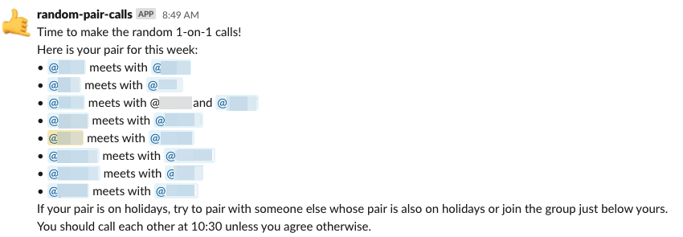
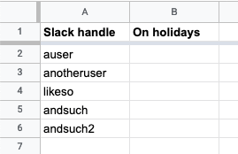

# Mobile Jazz's Random Calls Bot
This is a bot that sends a Slack message to your team with random pairs of people, so they can call each other and chat for a while, like this:

You can learn more about Mobile Jazz and this bot in our blog: [mobilejazz.com/blog](https://mobilejazz.com/blog).

## Installation
This bot uses a Google Spreadsheet as a data source to know who is available for a call and runs in Google Scripts.

Create a Google Spreadsheet with two columns, the Slack handle of each team member and optionally another column for people on holidays:

If someone is on holidays, mark them with an X and they will be excluded from the raffle.

Then, the code:

* Open **Tools** > **Script editor**
* Copy-paste `Code.js` and `tests.js` in the editor (or use a tool like [clasp](https://github.com/google/clasp) to load them if you're into command-line utilities)
* Edit the `TeamSlackRoom` URL to send the message to the Slack room you want
* Run a test, for example set up `TestSlackRoom` and run `testMakeRandomPairsAndAnnounceToRoom`, to make sure everything works properly and your script has permissions to run.
* Go to **Edit** > **Current project's triggers** to run this function automatically.
* Press **Add Trigger**, choose to run the function `makeRandomPairsAndAnnounce`, select `Time-driven` as event source and choose when do you want this trigger to run. For example, we run it weekly, every Wednesday at 7am.
* You're good to go!

**Note:** you might want to check the code a little and maybe customize it a bit. For example, you may want to change the message in the `formatPairs` function.

## Contributing
We consider the project "complete", but we accept pull requests for bug fixes. If you have an idea for additional functionality other than very minor improvements, consider forking this project.

## Credits
This project was built by various Mobile Jazz team members. If you'd like kickass software for your company, consider hiring us!

## License
This project is published under the [Apache License Version 2.0](https://www.apache.org/licenses/LICENSE-2.0).